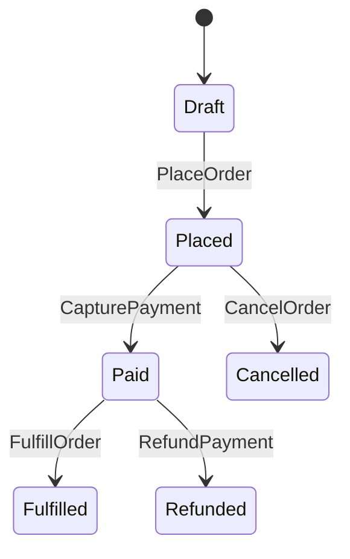

# Order Lifecycle (State Machine)

This will be refined as modules become real.

```mermaid
stateDiagram-v2
  [*] --> Draft
  Draft --> Placed: PlaceOrder
  Placed --> Paid: CapturePayment
  Placed --> Cancelled: CancelOrder
  Paid --> Fulfilled: FulfillOrder
  Paid --> Refunded: RefundPayment
```
